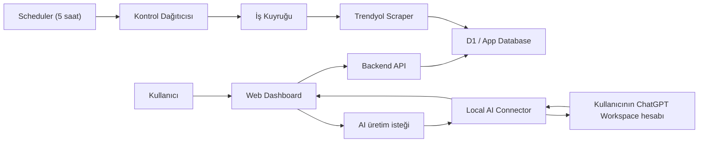

# Trendyol → Etsy Workflow Design

**Tarih:** 2026-03-19  
**Durum:** Tasarım onaylandı, implementation plan aşamasına hazır olmadan önce kullanıcı review bekleniyor  
**Kapsam:** Trendyol ürün linklerinden stok/fiyat takibi yapan, Etsy için düzenlenebilir SEO taslakları üreten, sunuculu web uygulaması

---

## 1. Amaç

Bu ürünün amacı, kullanıcının Trendyol üzerindeki kendi ürün linklerini tek tek sisteme ekleyip bu ürünleri sürekli takip edebilmesi, varyasyon bazlı stok ve fiyat değişimlerini izleyebilmesi, ürün verisini analiz ederek Etsy için optimize edilmiş İngilizce taslak alanlar üretebilmesidir.

İlk sürümde sistem:
- Trendyol ürün linklerini kaydeder
- ürünün güncel verisini çeker
- varyasyon bazlı stok durumunu izler
- her 5 saatte bir otomatik günceller
- fiyat geçmişi ile min/max fiyatı saklar
- değişim olduğunda uygulama içi bildirim oluşturur
- Etsy için title / description / tags gibi düzenlenebilir taslaklar sunar
- AI üretimini kullanıcının kendi ChatGPT Workspace hesabı üzerinden, local connector yaklaşımıyla tetikler

---

## 2. Kapsam ve ürün kararları

### 2.1 Dahil olanlar
- Sunuculu web uygulaması
- Tek kullanıcı desteği
- İlk sürümde 50–500 ürün takibi
- Ürünlerin tek tek link yapıştırılarak eklenmesi
- 5 saatte bir otomatik ürün kontrolü
- Ürün, varyasyon, stok ve fiyat verisinin saklanması
- Fiyat history, min fiyat, max fiyat
- Fiyat değişmiyorsa history açmama
- Uygulama içi bildirim merkezi
- Türkçe analiz + İngilizce Etsy çıktısı
- Manuel tetiklenen Etsy içerik üretimi (yeniden üret)
- Kullanıcının generated içeriği elle düzenleyebilmesi
- Çoklu AI hesap yönetimi için local connector destekli bağlantı ekranı

### 2.2 Dahil olmayanlar (MVP dışı)
- Etsy’ye otomatik listing gönderme
- Etsy API entegrasyonu
- Çok kullanıcılı yapı
- CSV / Excel bulk import
- Tam otomatik batch AI üretimi
- Ağır browser automation tabanlı scraping altyapısı
- Sunucu tarafında doğrudan OpenAI API billing ile çalışma

---

## 3. Stratejik kısıtlar

### 3.1 OpenAI / ChatGPT kısıtı
Kullanıcının mevcut ChatGPT Workspace hesabı var; ancak tasarım sürecinde doğrulanan resmi kaynaklara göre ChatGPT/Workspace ve API platformu ayrı faturalandırma ve erişim modeli kullanır. Bu nedenle sistem, kullanıcı hesabını klasik backend API anahtarı gibi kullanmayacaktır.

### 3.2 Seçilen çözüm
Bu kısıt nedeniyle AI mimarisi şu şekilde seçildi:
- ana uygulama sunucuda çalışır
- AI üretimi için kullanıcının cihazında çalışan bir **Local AI Connector** bulunur
- connector kullanıcının ChatGPT Workspace hesabıyla çalışır
- web uygulaması hazır promptları bu connector’a yollar
- sonuç web uygulamasına döner ve draft alanlarına kaydedilir

Bu çözüm, ek API maliyeti yaratmadan, kullanıcıya uygulama içinden “Üret” butonlarıyla çalışma deneyimi sağlar.

---

## 4. Mimari

## 4.1 Yüksek seviye mimari

## 4.2 Mimari prensipler
- Ücretsiz / çok düşük maliyetli altyapıya uygun olmalı
- Scraping katmanı ile ürün iş mantığı ayrılmalı
- Güncel durum ile tarihsel veri ayrıştırılmalı
- AI üretimi backend’e gömülmemeli, connector üzerinden çalışmalı
- Manual edit edilmiş alanlar korunmalı
- Hatalı parse tüm sistemi bloklamamalı

---

## 5. Scraping ve güncelleme modeli

## 5.1 Veri kaynağı
- Trendyol seller API kullanılmayacak
- Sistem doğrudan ürün linklerini tarayacak
- Ana yaklaşım: **HTTP fetch + parser**
- Browser fallback, ilk sürümde ana yöntem olmayacak

## 5.2 Otomatik kontrol akışı
Her 5 saatte bir:
1. takipteki aktif ürünler seçilir
2. ürünler sıraya alınır
3. her ürün yeniden taranır
4. ürün + varyasyon verisi parse edilir
5. önceki current state ile karşılaştırılır
6. current state güncellenir
7. değişiklik varsa history ve notification yazılır

## 5.3 Parse başarısızlıkları
Aşağıdaki durumlar desteklenmelidir:
- ürün sayfası açılamadı
- ürün kaldırıldı
- varyasyonlar okunamadı
- beklenen alanlar eksik geldi

Bu durumlarda ürün sistemden silinmez. Bunun yerine ürün durumu “İnceleme Gerekli” veya “Parse Hatası” olarak işaretlenir.

---

## 6. Veri modeli

## 6.1 Çekirdek tablolar

### products
Her takip edilen Trendyol ürününün ana kaydı.

Temel alanlar:
- id
- trendyol_url
- source_product_id (mümkünse çıkarılabilen kimlik)
- title
- brand
- category
- description_raw
- attributes_raw
- images_raw
- status
- parse_status
- last_checked_at
- created_at
- updated_at

### product_variants
Her ürünün varyasyon kombinasyonları.

Temel alanlar:
- id
- product_id
- variant_key
- option_1
- option_2
- option_3
- current_stock_state
- current_price
- last_seen_at
- raw_payload

### product_current_state
Dashboard için hızlı okunan özet durum.

Temel alanlar:
- product_id
- current_price
- min_price
- max_price
- in_stock_variant_count
- total_variant_count
- last_change_at
- last_checked_at

### price_history
Sadece fiyat değişince kayıt açılır.

Temel alanlar:
- id
- product_id
- variant_id (nullable)
- previous_price
- new_price
- changed_at
- change_reason

### stock_history
Sadece stok durumu değişince kayıt açılır.

Temel alanlar:
- id
- product_id
- variant_id
- previous_stock_state
- new_stock_state
- changed_at

### notifications
Uygulama içi bildirimler.

Temel alanlar:
- id
- product_id
- type
- severity
- title
- body
- read_at
- created_at

### etsy_drafts
Ürün bazlı Etsy taslak içeriği.

Temel alanlar:
- id
- product_id
- english_title
- short_description
- long_description
- tags_json
- materials_json
- attributes_json
- seo_notes
- policy_notes
- generated_version
- edited_version
- last_generated_at
- manual_edits_present

### ai_profiles (uygulama düzeyi gösterim için)
Sunucuda hassas ChatGPT session bilgisi saklamaz; yalnızca connector’dan gelen profil metadata’sı tutulur.

Temel alanlar:
- id
- label
- email_masked
- provider
- is_active
- last_seen_at
- connector_status_snapshot

---

## 7. Geçmiş verisi kuralları

### 7.1 Fiyat kuralları
- Yeni fiyat eski fiyatla aynıysa `price_history` açılmaz
- `current_price` güncellenir
- `last_checked_at` güncellenir
- `min_price` ve `max_price` gerekirse revize edilir

### 7.2 Stok kuralları
- Varyasyonun stok durumu değişmediyse `stock_history` açılmaz
- Değiştiyse history kaydı açılır
- Ürün toplam in-stock varyasyon sayısı güncellenir

### 7.3 History granularity
- Ürün bazlı genel fiyat değişimi
- Gerekirse varyasyon bazlı fiyat değişimi
- Varyasyon bazlı stok değişimi

---

## 8. Etsy draft üretim mantığı

## 8.1 Girdi
Etsy üretim ekranı şu kaynakları kullanır:
- Trendyol ürün başlığı
- ürün açıklaması
- kategori ve attribute bilgileri
- görsellerden türetilen temel semantik notlar (ileride mümkünse)
- varyasyon bilgileri
- güncel fiyat ve fiyat bandı
- kullanıcı notları
- güncel Etsy SEO kuralları

## 8.2 Çıktı alanları
- English title
- short description
- long description
- 13 tags
- materials suggestions
- attributes suggestions
- SEO notes
- policy / risk notes

## 8.3 Düzenleme kuralları
- Kullanıcı generated alanları elle düzenleyebilir
- Manual edit varsa sistem bunu işaretler
- “Yeniden üret” varsayılan olarak kullanıcı editini sessizce ezmez
- Gerekirse “üzerine yaz” aksiyonu ayrı olmalıdır

---

## 9. Local AI Connector tasarımı

## 9.1 Görevi
Local AI Connector, kullanıcının cihazında çalışan ve ChatGPT Workspace hesabı ile AI üretimini mümkün kılan yardımcı katmandır.

## 9.2 Temel işlevler
- ChatGPT hesabıyla giriş
- aktif hesabı bildirme
- çıkış yapma
- başka hesabı aktif etme
- hazır promptları alma
- sonucu uygulamaya geri döndürme
- bağlantı sağlık durumu bildirme

## 9.3 Güvenlik prensibi
- ChatGPT session / access bilgisi sunucuda tutulmaz
- Bu bilgi yalnızca local connector tarafında tutulur
- Sunucu yalnızca prompt isteği ve sonuç seviyesinde çalışır

## 9.4 Hata durumları
- connector offline
- connector yüklü değil
- oturum expired
- üretim başarısız
- hesap limiti / erişimi tükendi

Bu hatalar hem AI panelinde hem ilgili üretim aksiyonunda kullanıcıya açık şekilde gösterilmelidir.

---

## 10. Bilgi mimarisi

## 10.1 Ana sayfalar
- Link Tracking Center
- Product Detail
- SEO Analysis & Editor
- AI Connections
- Notifications
- Settings

## 10.2 Navigasyon yaklaşımı
Ana görsel baz **Link Tracking Center** olarak seçildi. Uygulama product-first yapıda kurgulanacak.

### Link Tracking Center
- link ekleme alanı
- takipteki ürünler
- filtreler
- ürün kartları / liste görünümü

### Product Detail
- Genel Özet
- Varyasyonlar
- Fiyat Geçmişi
- Stok Geçmişi
- SEO Analysis sekmesi

### SEO Analysis & Editor
- sol panel: kaynak ürün verisi
- sağ panel: Etsy optimize alanları
- alan bazlı üret butonları

### AI Connections
- aktif hesap
- bağlı hesaplar
- yeni hesap bağla
- local connector durumu

### Notifications
- fiyat arttı
- fiyat düştü
- stok dışı
- stoğa geri geldi
- parse hatası
- AI üretimi başarısız
- connector offline

### Settings
- kontrol aralığı
- görünüm tercihi
- prompt tercihleri
- connector health check

---

## 11. Görsel tasarım sistemi

Kullanıcının verdiği referans HTML/CSS örnekleri bağlayıcı görsel referans kabul edilmiştir.

## 11.1 Seçilen ana görsel baz
**Link Tracking Center** ekranı ana tasarım omurgası olarak seçildi.

## 11.2 Görsel sabitler
- Koyu lacivert sidebar (`#051125`, `#1B263B`)
- Açık yüzeyli, premium dashboard estetiği
- Turuncu vurgu (`#F1641E`)
- Tipografi: **Manrope + Inter**
- Rounded kartlar, yumuşak sınırlar, editorial premium görünüm
- Ürün odaklı giriş deneyimi

## 11.3 Ekran ailesi türetme kuralı
- Dashboard / Tracking ekranı: ürün odaklı kart ızgarası
- Product detail: bilgi yoğun ama temiz hiyerarşi
- SEO editor: split pane / source vs optimized output
- AI bağlantıları: yardımcı yönetim paneli ama aynı tasarım dilinde

---

## 12. Kritik kullanıcı akışları

## 12.1 Yeni ürün linki ekleme
1. kullanıcı link yapıştırır
2. sistem linki doğrular
3. ürünü tarar
4. parse sonucu ürün kaydı oluşturur
5. ürün track listesinde görünür

Hata durumunda ürün “inceleme gerekli” statüsünde bırakılabilir.

## 12.2 5 saatlik otomatik kontrol
1. scheduler tetiklenir
2. aktif ürünler sıraya alınır
3. scrape edilir
4. current state güncellenir
5. değişiklik varsa history + notification yazılır

## 12.3 Ürün detay inceleme
Kullanıcı ürün kartından detail ekranına gidip varyasyon, fiyat ve history detaylarını inceler.

## 12.4 AI üretim
1. kullanıcı SEO ekranında aksiyon seçer
2. sistem hazır prompt oluşturur
3. prompt connector’a gider
4. connector ChatGPT hesabında üretimi çalıştırır
5. sonuç draft alanına yazılır

## 12.5 Hesap değiştirme
1. kullanıcı AI Connections ekranına gider
2. çıkış yapar veya başka profili aktif eder
3. connector yeni hesapla senkronize olur
4. üretim butonları yeni profile göre devam eder

---

## 13. Edge case’ler ve korumalar

### 13.1 Veri tarafı
- aynı ürünün tekrar eklenmesi
- aynı ürünün farklı URL varyantları ile gelmesi
- ürün artık erişilemiyor olması
- varyasyon yapısının değişmesi
- fiyatın görünür, stok bilgisinin eksik olması

### 13.2 UI tarafı
- çok uzun başlık veya açıklama
- eksik draft alanları
- history büyümesi
- ürün ekleme sırasında sayfa değişimi

### 13.3 AI tarafı
- connector kapalı
- connector offline
- oturum süresi doldu
- yanlış hesap aktif
- üretim yarıda kaldı
- içerik kurallara tam uymadı

### 13.4 Zorunlu korumalar
- duplicate product detection
- parse failure state
- review needed state
- manual edits protection
- connector health state
- change-only history logging

---

## 14. Etsy SEO ve politika notları

Bu tasarımda Etsy için güncel resmi kaynaklar ürün girdisi olarak kullanılacaktır.

Kritik notlar:
- Başlık kısa, açık ve taranabilir olmalı
- Ürünün en önemli nitelikleri başta yer almalı
- Etsy arama görünürlüğü title, tags, attributes, description ve diğer sinyalleri birlikte değerlendirir
- 13 tag kullanılmalı
- Tag başına 20 karakter sınırı dikkate alınmalı
- Tekrarlı tags/categories/attributes kullanımından kaçınılmalı
- Açıklamanın ilk cümlelerinde ilgili anahtar kelimeler bulunmalı

Kaynaklar:
- https://www.etsy.com/seller-handbook/article/1399426136697
- https://www.etsy.com/se-en/seller-handbook/article/keywords-101-everything-you-need-to-know/382774281517
- https://www.etsy.com/seller-handbook/article/the-ultimate-guide-to-etsy-search/366469415790
- https://help.etsy.com/hc/en-us/articles/360024112614-What-Can-I-Sell-on-Etsy
- https://help.etsy.com/hc/en-us/articles/360000336547-Working-with-Production-Partners-on-Etsy

---

## 15. Test stratejisi

## 15.1 Unit test
- fiyat karşılaştırma
- min/max güncelleme
- history oluşturma kuralları
- stok state karşılaştırma
- prompt builder
- Etsy tag limit kontrolleri
- manual edit koruma mantığı

## 15.2 Integration test
- link ekleme → parse → kayıt
- scheduler → scrape → current state
- değişiklik → history + notification
- generate aksiyonu → connector çağrısı → draft kaydı
- hesap değişimi akışı

## 15.3 E2E test
- ürün ekleme
- ürün detay görüntüleme
- history görüntüleme
- draft üretme
- manuel düzenleme
- bildirimleri okuma

## 15.4 Fixture tabanlı scraper testleri
Parser güvenilirliği için gerçek HTML fixture örnekleri tutulmalı ve scraping mantığı bunlara karşı test edilmelidir.

---

## 16. Teknik sınırlar

- Trendyol HTML yapısı zamanla değişebilir
- Browser automation ana yaklaşım olmayacak
- AI üretimi local connector bağımlıdır
- Kullanıcı cihazı kapalıysa AI üretimi çalışmaz
- İlk sürüm tek kullanıcı içindir
- İlk sürüm 50–500 ürün aralığını hedefler

---

## 17. Kabul kriterleri

MVP aşağıdaki koşulları sağladığında başarılı kabul edilir:

### Ürün takibi
- Kullanıcı Trendyol linkini tek tek ekleyebilmeli
- Ürün verisi başarıyla kaydedilebilmeli
- Varyasyon bazlı stok durumu gösterilebilmeli
- 5 saatlik kontrol döngüsü çalışmalı

### Fiyat takibi
- Güncel fiyat gösterilmeli
- Min ve max fiyat doğru tutulmalı
- Aynı fiyat için gereksiz history yazılmamalı
- Fiyat değişimlerinde history oluşmalı

### Bildirim
- Fiyat ve stok değişimleri uygulama içinde görünmeli
- Parse hataları görünmeli

### SEO / Draft
- İngilizce Etsy alanları üretilebilmeli
- Kullanıcı bunları düzenleyebilmeli
- Üretim manuel tetiklenmeli
- Manual edit koruması bulunmalı

### AI bağlantısı
- Connector durumu görülebilmeli
- Aktif hesap görülebilmeli
- Hesap değiştirilebilmeli
- Connector kapalıysa açık hata gösterilmeli

### Tasarım
- Referans verilen tasarım sistemi korunmalı
- Ana baz ekran “Link Tracking Center” çizgisinde olmalı

---

## 18. Sonraki adım

Bu doküman onaylandıktan sonra bir implementation plan yazılacaktır. Plan; backend, scraper, data model, dashboard, AI connector entegrasyonu ve test adımlarını ayrıntılı olarak parçalayacaktır.
