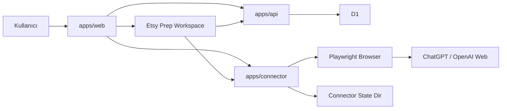

# AI Bağlantıları ve ChatGPT Web Oturum Yönetimi Tasarımı

**Tarih:** 2026-03-24  
**Durum:** Tasarım onaylandı  
**Kapsam:** `AI Bağlantıları` ekranından gerçek ChatGPT / OpenAI web hesabı bağlama, çoklu hesap yönetimi, kalıcı local connector oturumu ve `Etsy'e Yükle` alan üretimlerinin aktif bağlı hesap üzerinden çalıştırılması

---

## 1. Amaç

Bu değişikliğin amacı, uygulamadaki `AI Bağlantıları` alanını yalnızca durum gösteren bir ekran olmaktan çıkarıp gerçekten çalışan bir bağlantı merkezi haline getirmektir.

Beklenen ürün davranışı şudur:

- kullanıcı `AI Bağlantıları` ekranından gerçek ChatGPT hesabı bağlayabilir
- bağlantı local connector üzerinden başlatılır
- connector bir tarayıcı açar ve kullanıcı girişini orada tamamlar
- bağlanan hesap uygulamada görünür
- birden fazla hesap bağlanabilir
- bağlı hesaplardan biri aktif seçilebilir
- connector yeniden başladığında oturum mümkün olduğunca korunur
- `Etsy'e Yükle` içindeki `Title`, `Description` ve `Tags` üretimleri aktif bağlı hesap üzerinden gerçekten çalışır

Bu iterasyonun amacı resmi OpenAI API entegrasyonu değildir. Kullanıcı tercihi doğrultusunda çözüm, local connector tarafından yönetilen gerçek web oturumu üzerinden kurulacaktır.

---

## 2. Onaylanan ürün kararları

- Bağlantı modeli resmi OpenAI API key akışı değil, local connector tarafından yönetilen **ChatGPT / OpenAI web oturumu** olacaktır.
- `AI Bağlantıları` ekranındaki ana aksiyon, connector üzerinden tarayıcı açarak giriş başlatacaktır.
- Kullanıcı bağlı hesabı uygulama içinde görebilecektir.
- İlk sürümde **çoklu hesap** desteklenecektir.
- Çoklu hesapta kullanıcı bağlı hesap listesini görür ve bir hesabı `Aktif` yapabilir.
- Oturum mümkünse connector yeniden başlasa da korunacaktır.
- Hassas oturum verisi web uygulamasında veya API veritabanında tutulmayacaktır.
- Web uygulaması yalnızca maskeleştirilmiş hesap bilgisi, durum ve aktif hesap bilgisini gösterecektir.
- `Etsy'e Yükle` alan üretimleri yalnızca aktif ve geçerli connector hesabı varsa çalışacaktır.
- API key alanı, resmi OpenAI API entegrasyonu veya başka provider desteği bu spec kapsamı dışındadır.

---

## 3. Seçilen yaklaşım

Üç aday yaklaşım içinden seçilen çözüm şudur:

- gerçek bağlantı sahipliği `apps/connector` katmanında kalır
- `apps/web` bağlantıyı başlatır, durumu gösterir ve hesap yönetimi UI'ını sunar
- `apps/api` ürün ve hazırlık ekranları için connector metadata snapshot'ını okumaya devam eder
- üretim çağrıları mevcut prompt hazırlama akışını korur, ancak son adımda connector gerçekten aktif ChatGPT oturumu ile üretim yapar

Bu yaklaşımın seçilme nedenleri:

- mevcut `chatgpt-web` provider ve Playwright tabanı ile en uyumlu çözümdür
- istenen “tarayıcı aç, kullanıcı giriş yapsın, sonra uygulamada bağlı hesabı gör” deneyimini doğrudan destekler
- çoklu hesap ve kalıcı oturum yönetimini ürünleştirmek için doğru sahiplik sınırını kurar
- `Etsy'e Yükle` tarafındaki mevcut `prompt_ready -> connector generate` akışını çöpe atmadan gerçek hale getirir

Seçilmeyen yaklaşımlar:

- resmi OpenAI API / API key ile çalışma: kullanıcı isteğine ve seçilen güven modeline uymaz
- web uygulamasının doğrudan oturum sahibi olması: hassas browser session bilgisini yanlış katmana taşır
- ilk sürümde ağır bir tam hesap merkezi kurmak: kapsamı gereksiz büyütür

---

## 4. Sistem sınırı ve mimari

### 4.1 Yüksek seviye mimari

### 4.2 Sorumluluk sınırları

### `apps/web`
- bağlantı başlatma UI'ı
- bağlantı denemesi durumunu gösterme
- bağlı hesapları listeleme
- aktif hesap değiştirme
- yeniden bağlan / kaldır aksiyonları
- `Etsy'e Yükle` ekranında üretim bloklama mesajları ve CTA'lar

### `apps/connector`
- tarayıcı açma
- ChatGPT login akışını başlatma
- oturumun tamamlandığını ve kullanılabilir olduğunu doğrulama
- bağlı profil metadata'sını saklama
- profil bazlı browser session storage alanını yönetme
- aktif profili belirleme
- üretim isteklerini aktif profil üzerinden çalıştırma

### `apps/api`
- `Etsy'e Yükle` için ürün ve hazırlık verisini sağlama
- Etsy odaklı analiz ve alan bazlı prompt paketlerini üretme
- connector metadata snapshot'ını uygulama içinde gösterim amaçlı saklama

### 4.3 Güven modeli

- hassas giriş bilgileri web uygulamasına taşınmaz
- `apps/api` yalnızca maskeleştirilmiş profil metadata'sı görür
- gerçek browser session verisi yalnızca connector state alanında yaşar
- connector tek kullanıcı yerel yardımcı servis olarak kabul edilir

---

## 5. Kullanıcı akışı

### 5.1 İlk bağlantı

`AI Bağlantıları` ekranında bağlı hesap yoksa kullanıcı şunu görür:

- connector durumu
- `OpenAI ile Bağlan` ana aksiyonu
- bağlı hesap olmadığını söyleyen boş durum

Kullanıcı `OpenAI ile Bağlan` dediğinde:

1. web uygulaması connector'da yeni bir bağlantı denemesi başlatır
2. connector yeni bir `connectionAttemptId` üretir
3. connector Playwright ile tarayıcı açar
4. kullanıcı ChatGPT / OpenAI girişini tarayıcıda tamamlar
5. web uygulaması deneme durumunu poll eder
6. connector oturumu doğrular ve profil metadata'sını kaydeder
7. bağlantı tamamlanınca hesap listede görünür ve gerekirse aktif hesap olur

### 5.2 Çoklu hesap yönetimi

İlk sürümde birden fazla ChatGPT hesabı bağlanabilir.

Her bağlı hesap için uygulama şunları gösterir:

- hesap etiketi
- maskeleştirilmiş e-posta veya kullanıcı tanımlayıcısı
- provider bilgisi
- bağlantı durumu
- aktif hesap rozeti
- `Aktif Yap`
- `Yeniden Bağlan`
- `Bağlantıyı Kaldır`

İlk bağlı hesap varsayılan aktif hesap olabilir. Sonraki hesaplarda kullanıcı açıkça aktif hesabı değiştirir.

### 5.3 `Etsy'e Yükle` entegrasyonu

Ürün detayındaki `Hazırlık` alanı bugünkü temel akışı korur:

1. `apps/api` genel analiz veya alan bazlı prompt paketini üretir
2. web uygulaması `prompt_ready` olayını alır
3. web uygulaması connector'a `generate-field` çağrısı yapar
4. connector aktif ve geçerli hesabı kullanarak ChatGPT web üretimini çalıştırır
5. sonuç ilgili edit alanına yazılır

Aktif geçerli hesap yoksa:

- alan üretim butonları bloklanır
- kullanıcıya neden gösterilir
- `AI Bağlantıları` sayfasına giden CTA sunulur

---

## 6. Connector durum modeli

### 6.1 Geçici bağlantı denemesi durumu

Bağlantı denemeleri kalıcı profilden ayrı bir geçici varlık olarak izlenir.

Bağlantı denemesi durumları:

- `pending_browser_launch`
- `waiting_for_login`
- `verifying_session`
- `completed`
- `failed`
- `cancelled`

Bu ayrım önemlidir; çünkü “şu anda giriş bekleniyor” ile “kayıtlı ama artık yeniden doğrulanmalı” aynı şey değildir.

### 6.2 Kalıcı profil durumu

Her kayıtlı profil şu durumlardan birinde olur:

- `connected`
- `needs_reauth`
- `disconnected`
- `error`

`connected` durumundaki profil üretim için kullanılabilir kabul edilir.  
`needs_reauth` üretimi bloklar ama profil listede kalır.  
`disconnected` kaldırılmış veya artık kullanılamayan kayıttır.  
`error` beklenmeyen connector veya provider problemi olduğunu gösterir.

### 6.3 Sağlık kontrolü

Connector sağlık çıktısı yalnızca “server açık mı” değil, şu bilgileri de vermelidir:

- provider
- aktif profil var mı
- aktif profil durumu
- bağlantı denemesi devam ediyor mu
- son doğrulama zamanı
- son hata özeti

---

## 7. Connector veri modeli ve kalıcılık

### 7.1 Mevcut durumun yetersizliği

Bugünkü `profiles.json` yalnızca temel profil listesi ve aktif profil kimliği taşır. Bu yapı, çoklu hesap, yeniden bağlanma, durum yönetimi ve kalıcı browser session için yetersizdir.

### 7.2 Önerilen profil metadata alanları

Her profil için en az şu metadata tutulmalıdır:

- `id`
- `provider`
- `label`
- `emailMasked`
- `status`
- `createdAt`
- `updatedAt`
- `lastValidatedAt`
- `browserStorageKey`
- `lastError`

### 7.3 Hassas oturum verisi

Hassas oturum verisi profil JSON kaydına yazılmayacaktır.

Bunun yerine connector:

- her profil için ayrı bir browser storage klasörü kullanır
- Playwright context'i bu kalıcı profile storage üzerinde açar
- yeniden başlatmada aynı storage ile oturumu geri kullanmayı dener

Bu sayede:

- connector yeniden başlasa da oturum korunabilir
- profil metadata'sı ile hassas session verisi birbirinden ayrılır
- hesap silme sırasında metadata ve session storage birlikte temizlenebilir

### 7.4 State dizini

Mevcut `CONNECTOR_STATE_DIR` kullanılmaya devam eder, fakat yapı genişler:

- `profiles.json` veya eşdeğer metadata dosyası
- bağlantı denemeleri için geçici durum alanı
- profil bazlı kalıcı browser storage klasörleri

---

## 8. API tasarımı

### 8.1 Connector endpointleri

Yeni veya genişletilmiş connector sözleşmesi şu endpointleri içerir:

- `POST /connections/openai/start`
- `GET /connections/openai/attempts/:attemptId`
- `POST /connections/openai/attempts/:attemptId/cancel`
- `GET /profiles`
- `POST /profiles/:id/activate`
- `POST /profiles/:id/reconnect`
- `DELETE /profiles/:id`
- `GET /health`
- `POST /generate-field`

### 8.2 Endpoint davranışları

### `POST /connections/openai/start`
- yeni bağlantı denemesi oluşturur
- tarayıcı açma sürecini başlatır
- deneme kimliği ve ilk durum bilgisini döner

### `GET /connections/openai/attempts/:attemptId`
- web uygulamasının poll edeceği durum endpointidir
- deneme durumunu, hata varsa hata özetini ve tamamlandıysa profil özetini döner

### `POST /profiles/:id/reconnect`
- seçili profil için yeniden giriş sürecini başlatır
- yeni bağlantı denemesi oluşturabilir

### `DELETE /profiles/:id`
- profil metadata'sını siler
- profile ait browser storage klasörünü temizler
- aktif profil siliniyorsa aktiflik yeniden hesaplanır

### `GET /profiles`
- kayıtlı profilleri ve aktif profili döner
- mevcut yanıta profil durum bilgisini ekler

### `GET /health`
- connector ve aktif profil sağlığını döner

### 8.3 Web ve API ilişkisi

Web uygulaması connector ile doğrudan konuşmaya devam edebilir.  
`apps/api` tarafındaki `ai_profiles` senkronu tamamen kaldırılmak zorunda değildir; ancak bu veri gösterim amaçlı ikincil snapshot olarak ele alınmalıdır. Gerçek kaynak connector olacaktır.

---

## 9. Web uygulaması değişiklikleri

### 9.1 `AI Bağlantıları` ekranı

Bu ekranın bugünkü sadece durum + aktif yap görünümünden çıkarılması gerekir.

Yeni davranışlar:

- boş durum kartı
- `OpenAI ile Bağlan` ana aksiyonu
- bağlantı denemesi sürerken bekleme durumu
- bağlı hesap listesi
- aktif hesap rozeti
- `Aktif Yap`
- `Yeniden Bağlan`
- `Bağlantıyı Kaldır`
- connector veya bağlantı hataları için görünür açıklama

### 9.2 `EtsyPrepWorkspace`

Hazırlık ekranındaki bugünkü bloklama mantığı daha ayrıntılı hale gelir.

Alan üretimlerinde şu durumlar ayrıştırılmalıdır:

- aktif profil yok
- yeniden giriş gerekli
- bağlantı denemesi devam ediyor
- connector erişilemiyor
- alan üretimi başarısız oldu

Kullanıcıya mümkün olduğunca hedefli aksiyon verilmelidir:

- `AI Bağlantıları` sayfasına git
- `Yeniden Bağlan`
- `Tekrar Dene`

### 9.3 Görsel durumlar

Web tarafındaki iyi UX parçaları özellikle korunmalıdır:

- `bağlantı başlatılıyor`
- `tarayıcıda giriş bekleniyor`
- `bağlı`
- `yeniden bağlanmalı`
- `hata`

Bu ekran, sistemin ne yaptığını belirsiz bırakmamalıdır.

---

## 10. Üretim entegrasyonu

### 10.1 Mevcut akışın korunması

Bugünkü alan bazlı prompt hazırlama akışı korunacaktır:

- `apps/api` Etsy araştırma ve prompt paketini üretir
- web uygulaması `prompt_ready` olayını alır
- connector yapılandırılmış prompt ile çağrılır

Bu spec, prompt tasarımını baştan kurmaz; bağlanabilirlik ve üretimin gerçekten çalışması üzerine odaklanır.

### 10.2 Connector üretim ön koşulları

`generate-field` çağrısı öncesinde connector şu kontrolleri yapmalıdır:

- aktif profil var mı
- aktif profil `connected` durumda mı
- bu profilin browser storage'ı yüklenebiliyor mu
- gerekiyorsa session doğrulaması geçiyor mu

Bu kontrollerden biri başarısızsa connector yapılandırılmış hata döndürmelidir.

### 10.3 Eşzamanlılık kuralı

İlk iterasyonda aynı anda birden fazla browser otomasyonu güvenli kabul edilmeyecektir.

Bu nedenle connector içinde:

- tek aktif üretim akışı serialize edilebilir
- aynı browser context içinde çakışan üretimler engellenebilir veya sıraya alınabilir

Bu tercih, ilk sürümde kararlılığı optimize eder.

---

## 11. Hata yönetimi

Connector hata tipleri uygulama tarafından ayırt edilebilir olmalıdır.

Önerilen hata kodları:

- `NO_ACTIVE_PROFILE`
- `PROFILE_NEEDS_REAUTH`
- `LOGIN_IN_PROGRESS`
- `CONNECTOR_OFFLINE`
- `GENERATION_FAILED`
- `PROVIDER_UI_CHANGED`

Bu ayrım sayesinde:

- `AI Bağlantıları` ekranı doğru durum mesajı gösterebilir
- `Etsy'e Yükle` ekranı kullanıcıyı doğru CTA'ya yönlendirebilir
- genel ekranı çökertmeden alan bazlı hatalar yönetilebilir

Özellikle `PROVIDER_UI_CHANGED` durumu önemlidir; çünkü ChatGPT web arayüzü değişirse connector akışı kırılabilir. Bu durumda kullanıcıya anlaşılır mesaj verilmeli ve hata tanısı kaydedilmelidir.

---

## 12. Test stratejisi

### 12.1 Connector testleri

Testler aşağıdakileri doğrulamalıdır:

- bağlantı başlatma yeni bir deneme oluşturur
- deneme durumu beklenen yaşam döngüsünden geçer
- login tamamlanınca profil `connected` olur
- yeniden başlatma sonrası profil metadata'sı ve browser storage yüklenebilir
- `activate`, `reconnect` ve `delete` davranışları doğru çalışır

### 12.2 Web testleri

Testler aşağıdakileri doğrulamalıdır:

- `AI Bağlantıları` ekranı boş durum, bekleme, bağlı, yeniden bağlanmalı ve hata durumlarını doğru gösterir
- bağlı hesap listesi aktif hesap rozetini doğru gösterir
- aktif hesap değişimi sonrası UI yenilenir
- `Yeniden Bağlan` ve `Bağlantıyı Kaldır` aksiyonları doğru connector çağrılarını yapar

### 12.3 Hazırlık ekranı testleri

Testler aşağıdakileri doğrulamalıdır:

- aktif hesap yoksa alan üretimi bloklanır
- yeniden bağlanma gerekiyorsa doğru CTA görünür
- bağlantı sağlıklıysa `prompt_ready -> connector generate -> editöre yaz` akışı tamamlanır
- tek alan hatası diğer alanları kilitlemez

---

## 13. Uygulama sınırları

Bu çalışma aşağıdakileri kapsamaz:

- resmi OpenAI API veya API key entegrasyonu
- başka AI provider ekleme
- arka planda sessiz otomatik oturum yenileme
- çok kullanıcılı connector güven modeli
- üretim promptlarının büyük çaplı yeniden tasarımı
- publish, listing gönderme veya Etsy mağaza API entegrasyonu

Bu sınırlar özellikle korunmalıdır; çünkü bu iterasyonun hedefi bağlantı ve üretim akışını gerçekten çalışır hale getirmektir.
