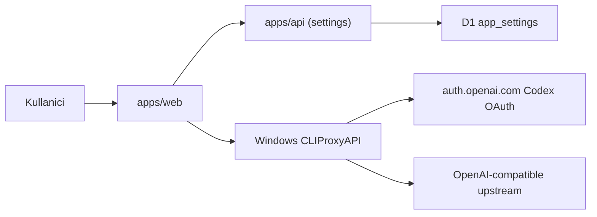

# AI Baglantilari Icin CLIProxyAPI Codex OAuth Dogrudan Baglanti Tasarimi

**Tarih:** 2026-03-25  
**Durum:** Tasarim onaylandi  
**Kapsam:** `AI Baglantilari` ve uretim akislarini mevcut `apps/api` OpenAI OAuth zincirinden cikarip tek hedef `Windows CLIProxyAPI` uzerinden, dogrudan `apps/web` tarafindan calistirmak

---

## 1. Amac

Bu degisikligin amaci, uygulamadaki AI baglanti ve uretim akislarini tek ve net bir modele indirmektir:

- baglanti: `AI Baglantilari` ekrani dogrudan `Windows CLIProxyAPI` management endpointleri ile calisir
- uretim: `Etsy'e Yukle` ve ilgili alan uretimleri dogrudan ayni hedefin OpenAI-compatible endpointlerine gider
- hesap yonetimi: bagli hesabi silip farkli workspace hesabi baglama kullanici tarafinda kesintisiz yapilabilir

Bu iterasyonda resmi OpenAI API key odakli backend OAuth modeli hedef disidir. Secilen model, Codex OAuth kayitlarini `CLIProxyAPI` icinde tutup web istemcisinin bu sisteme dogrudan konusmasidir.

---

## 2. Onaylanan urun kararlar

- Ana model `Tam gecis`tir: AI akislarinin tamami `Windows CLIProxyAPI` hedefinde toplanir.
- Ag erisimi internet uzerindendir (farkli aglardan erisim senaryosu).
- Hedef konfig urasyonu ilk surumde tek hedeftir (`Windows`).
- Manuel gecis/yonetim alani `AI Baglantilari` sayfasinda bulunur.
- Secili hedef tum akislari etkiler:
  - baglanti baslatma
  - baglanti durumu
  - profil listeleme/aktifleme/silme
  - uretim cagrilari
- Profil/hisap verisi hedefe ozeldir; ortak profil havuzu varsayilmaz.
- Hedef bilgisi hem backend ayari olarak saklanir hem `localStorage` ile cachelenir.
- Kullanici bagli hesabi silebilir ve farkli workspace hesabini yeniden baglayabilir.

---

## 3. Kapsam ve kapsam disi

### 3.1 Kapsam

- `apps/web` tarafinda yeni CLIProxy istemci katmani
- `AI Baglantilari` ekraninda hedef konfig paneli + Codex auth dosya listesi tabanli hesap yonetimi
- uretim cagrilarinin dogrudan hedef `CLIProxyAPI` OpenAI-compatible endpointlerine tasinmasi
- `apps/api` settings modelinde hedef baglanti ayarlarinin kalici tutulmasi
- testlerin yeni akisa gore guncellenmesi

### 3.2 Kapsam disi

- otomatik failover / coklu hedef orkestrasyonu
- ileri seviye guvenlik sertlestirmeleri
- `apps/api` icinde yeni bir AI orchestration gateway yazimi
- CLIProxyAPI icine yeni provider gelistirmesi

---

## 4. Degerlendirilen yaklasimlar

### Yaklasim A - Tam gecis (secilen)

Web istemcisi `CLIProxyAPI` ile dogrudan konusur. Mevcut `apps/api` OpenAI OAuth zinciri aktif akistan cikar.

**Artilar**
- Tek akis, daha dusuk operasyonel karmasa
- Kullanici beklentisi ile urun davranisi hizali
- Hesap yonetimi ve uretim ayni sistemde toplaniyor

**Eksiler**
- Eski `apps/api` OpenAI OAuth modulu artik urunun ana akisinda kullanilmaz

### Yaklasim B - Kademeli gecis

Baglanti yeni modele gecer, uretim bir sure eski modelde kalir.

**Artilar**
- Gecis riski kademeli dusurulur

**Eksiler**
- Iki farkli AI akisinin birlikte yasamasi kodu karmasiklastirir

### Yaklasim C - Uyumluluk/fallback modu

Yeni akis varsayilan olur ama eski akis fallback olarak tutulur.

**Artilar**
- Geri donus kolayligi

**Eksiler**
- YAGNI ihlali ve uzun sureli teknik borc riski

Secilen yaklasim: Yaklasim A.

---

## 5. Sistem siniri ve mimari

### 5.1 Yuksek seviye mimari

### 5.2 Sorumluluklar

#### `apps/web`
- hedef ayarini okuma/yazma
- `AI Baglantilari` ekraninda OAuth baslatma ve durum polling
- hesaplari listeleme, aktifleme, silme
- uretim cagrilarini hedefe dogrudan gonderme

#### `apps/api`
- sadece uygulama ayarlari icin kalici kaynak (tek hedef config)
- web istemcinin hedef ayarini cihazlar arasi senkron tutmasi

#### `Windows CLIProxyAPI`
- Codex OAuth baglanti kayitlarini tutma
- auth dosyasi bazli hesap envanteri
- OpenAI-compatible uretim endpointlerini servis etme

---

## 6. Veri modeli ve kalicilik

### 6.1 Backend (`app_settings`)

`app_settings` kaydina AI hedef alanlari eklenir:

- `ai_target_base_url` (string, zorunlu)
- `ai_target_management_key` (string, zorunlu)
- `ai_target_label` (string, opsiyonel; varsayilan `Windows`)

Not: Bu surumde tek hedef oldugu icin array yerine tek kayit modeli secilir.

### 6.2 Frontend local cache

`localStorage` anahtarlari:

- `aiTarget.baseUrl`
- `aiTarget.label`
- `aiTarget.updatedAt`

Yukleme sirasi:
1. once `localStorage` ile hizli ilk render
2. sonra backend `GET /settings` ile kesin deger
3. fark varsa backend degeri local cache uzerine yazilir

### 6.3 Hedefe ozel hesap modeli

Hesaplar uygulama DB'sinde tutulmaz; kaynak dogrudan hedef CLIProxy `auth-files` cevabidir.
Bu nedenle hedef degisince hesap listesi dogal olarak degisir.

---

## 7. API ve endpoint sozlesmeleri

### 7.1 Web -> Apps API (settings)

- `GET /settings`
- `PATCH /settings`
  - yeni alanlarla hedef config guncellenir

### 7.2 Web -> Windows CLIProxy management

Header:
- `Authorization: Bearer <management_key>` veya `X-Management-Key`

Akis endpointleri:
- `GET /v0/management/codex-auth-url?is_webui=1`
- `GET /v0/management/get-auth-status?state=<state>`
- `GET /v0/management/auth-files`
- `PATCH /v0/management/auth-files/status`
- `DELETE /v0/management/auth-files?name=<name>`

### 7.3 Web -> Windows CLIProxy inference

- `POST /v1/chat/completions` (ve varsa kullanilan diger OpenAI-compatible routelar)
- Giris icin uygulama istemci API key modeli (`api-keys`) kullanilir

---

## 8. Kullanici akislari

### 8.1 Ilk baglanti

1. Kullanici `AI Baglantilari > OpenAI ile Baglan` tiklar
2. Web, `codex-auth-url` cagirir
3. Donen URL yeni sekmede acilir
4. UI `state` ile `get-auth-status` poll eder
5. `ok` oldugunda `auth-files` yenilenir ve hesap gorunur

### 8.2 Aktif hesap secimi

CLIProxy tarafinda dogrudan "tek aktif" flagi olmadigi icin urun kurali:

- secilen hesap: `disabled=false`
- diger tum codex hesaplar: `disabled=true`

Bu toggle zinciri `PATCH /auth-files/status` ile uygulanir.

### 8.3 Hesap silme ve farkli workspace baglama

1. Kullanici hesap kartinda `Baglantiyi Kaldir` tiklar
2. Web, `DELETE /auth-files?name=...` cagirir
3. Liste yenilenir
4. Kullanici tekrar `OpenAI ile Baglan` ile farkli workspace hesabina girer

### 8.4 Uretim

1. Uretim tetiklenir (`title/description/tags`)
2. Web, secili hedefe dogrudan `/v1/chat/completions` cagrisi yapar
3. Yanit parse edilip editor alanina yazilir

---

## 9. Hata yonetimi

### 9.1 Hedef erisim hatalari

- timeout / DNS / 5xx: "Hedef sunucuya ulasilamiyor"
- 401/403 management: "Management key gecersiz"
- 401/403 inference: "Uretim anahtari gecersiz veya yetkisiz"

### 9.2 OAuth polling durumlari

- `wait`: "Tarayicida giris bekleniyor"
- `ok`: basari
- `error`: CLIProxy tarafindan gelen hata metni UI'da gosterilir

### 9.3 Uretim bloklama

Asagidaki durumlarda uretim butonlari pasif:
- codex hesap yok
- tum hesaplar disabled
- hedef config eksik/gecersiz

---

## 10. Internet kullaniminda kritik operasyon notu

Bu tasarimda Codex OAuth callback akisi `localhost:1455` callback forwarder modeline baglidir.
Bu nedenle OAuth login tamamlanmasi Windows sunucunun oturumunda (ornegin RDP ile) yapilmalidir.

Urun davranisi:
- `AI Baglantilari` ekrani baglanti baslatildiginda acik bir "Windows oturumunda giris tamamlayin" bilgilendirmesi gosterir.
- Login tamamlandiktan sonra uygulama internetten normal sekilde hesap listesini gorur ve uretime devam eder.

---

## 11. Test stratejisi

### 11.1 Web testleri

- hedef config paneli:
  - backend oku/yaz
  - localStorage sync
- baglanti akisi:
  - codex-auth-url cagrisi
  - polling (`wait -> ok`, `wait -> error`)
- hesap yonetimi:
  - listeleme (`auth-files`)
  - aktifleme (disabled toggle zinciri)
  - silme
- uretim:
  - dogrudan hedef `/v1/chat/completions`
  - hedef hatalarinda dogru mesaj

### 11.2 API testleri

- `settings` route'unda yeni ai target alanlari icin validation ve persistence

### 11.3 Manuel smoke

1. Windows CLIProxy ayaga kalkar
2. AI Baglantilari'ndan baglanti baslatilir
3. Hesap listede gorunur
4. Hesap silinir
5. Farkli workspace hesabiyla yeniden baglanilir
6. Uretim basarili calisir

---

## 12. Gecis stratejisi

1. Web tarafinda CLIProxy client ve AI Baglantilari yeni akisi devreye alinir
2. Settings modeline hedef alanlari eklenir
3. Uretim cagrilari yeni dogrudan hedefe tasinir
4. Eski `apps/api` OpenAI OAuth kodu `legacy` olarak isaretlenir ve ana akistan cikartilir

Bu sira, kullaniciya kesintisiz gecis saglamak ve testleri kontrollu guncellemek icin secilmistir.
